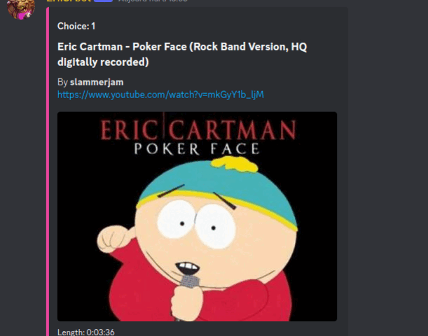

<div id="header" align="center">


</div>

# E.T.C Discord bot  [EN]
        *Small program made during the first confinement in France.*

## Description
### What does it do?
**E.T.C Bot** is a Python project and  a discord bot that allows users to listen to music from YouTube. The bot responds to a number of commands, including !leave, !stop, !resume, !pause, !join, and !play.

### Technologies used
- Python 3.10.6
- pre-commit

### Commands
- !leave: The bot leaves the voice channel.
- !stop: The bot stops playing music.
- !resume: The bot resumes playing paused music.
- !pause: The bot pauses the current music playback.
- !join: The bot joins the voice channel of the user.
- !play: The bot plays music from either a YouTube link or a search query.

To play a video from a link, simply enter !play followed by the URL:
```bash
    !play https://www.youtube.com/watch?v=dQw4w9WgXcQ
```
OR to search for a video, enter !play followed by a search query.
```bash
    !play lady gaga poker face by cartman
```


## Installation
1. Clone the repo.
```bash
    git clone https://github.com/PierreSaumet/music_discord.git <NAME_FOLDER>
```

2. Create env.
```bash
    python3 -m venv env
```

3. Active it.
```bash
    source env/bin/activate
```

4. Install dependencies.
```bash
    pip install -r requirements.txt
```

5. Install ffmpeg.
```bash
    sudo apt install ffmpeg
```

6. Change .env.file to .env and add your discord token
```bash
    mv .env.file .env
```
```bash
    DISCORD_TOKEN=YOUR_TOKEN_HERE   <== WRITE YOUR TOKEN HERE
```

7. In the srcs folder, create a 'databases' folder and retrieve the path into the .env file
```bash
    cd srcs && mkdir databases
```
```bash
    cd databases && pwd   <== Get path of the folder
```
```bash
    DB_USERS_PATH=YOUR_PATH_TO_DB   <== WRITE PATH HERE
    DB_MUSIC_PATH=YOUR_PATH_TO_DB   <== WRITE PATH HERE
```

8. Start programm.
```bash
    python3 main.py
```

## Documentation
discord python = https://discordpy.readthedocs.io/en/stable/

PEP 8 = https://peps.python.org/pep-0008/

youtube_dl = https://youtube-dl.org/

E.T.C = https://wowwiki-archive.fandom.com/wiki/Elite_Tauren_Chieftain


# E.T.C bot Discord [FR]
        *Petit programme réalisé durant le premier confinement en France.*

## Description
### Que fait-il ?
**E.T.C Bot** est un projet en python et c'est un bot Discord qui permet aux utilisateurs d'écouter de la musique depuis YouTube. Le bot répond à plusieurs commandes, dont !leave, !stop, !resume, !pause, !join et !play.

### Technologies utilisées
- Python 3.10.6
- pre-commit

### Commands
!leave: Le bot quitte le salon vocal.
!stop: Le bot arrête de jouer de la musique.
!resume: Le bot reprend la lecture de la musique en pause.
!pause: Le bot met en pause la lecture de la musique en cours.
!join: Le bot rejoint le salon vocal de l'utilisateur.
!play: Le bot joue de la musique à partir d'un lien YouTube ou d'une requête de recherche.

Pour lire une vidéo à partir d'un lien, entrez simplement !play suivi de l'URL :
```bash
    !play https://www.youtube.com/watch?v=dQw4w9WgXcQ
```
OU pour rechercher une vidéo, entrez !play suivi d'une requête de recherche.
```bash
    !play lady gaga poker face by cartman
```


## Installation
1. Clonez le repo.
```bash
    git clone https://github.com/PierreSaumet/music_discord.git <NAME_FOLDER>
```

2. Créez l'environnement virtuel.
```bash
    python3 -m venv env
```

3. Activez l'environnement virtuel.
```bash
    source env/bin/activate
```

4. Installez les dépendances.
```bash
    pip install -r requirements.txt
```

5. Installez ffmpeg.
```bash
    sudo apt install ffmpeg
```

6. Renommez .env.file en .env et ajoutez votre jeton Discord
```bash
    mv .env.file .env
```
```bash
    DISCORD_TOKEN=YOUR_TOKEN_HERE   <== ECRIRE LE TOKEN ICI
```

7. Dans le dossier srcs, créer un dossier databases et recupérer le chemin pour le fichier .env
```bash
    cd srcs && mkdir databases
```
```bash
    cd databases && pwd   <== récuperer le chemin
```
```bash
    DB_USERS_PATH=YOUR_PATH_TO_DB   <== ECRIRE LE CHEMIN ICI
    DB_MUSIC_PATH=YOUR_PATH_TO_DB   <== ECRIRE LE CHEMIN ICI
```

8. Lancez le programme.
```bash
    python3 main.py
```

## Documentation
discord python = https://discordpy.readthedocs.io/en/stable/

PEP 8 = https://peps.python.org/pep-0008/

youtube_dl = https://youtube-dl.org/

E.T.C = https://wowwiki-archive.fandom.com/wiki/Elite_Tauren_Chieftain
